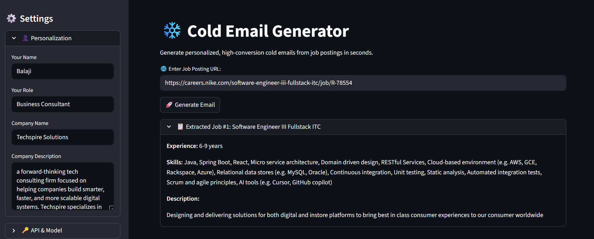
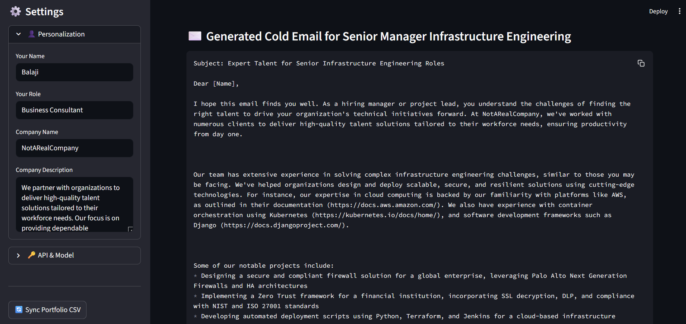
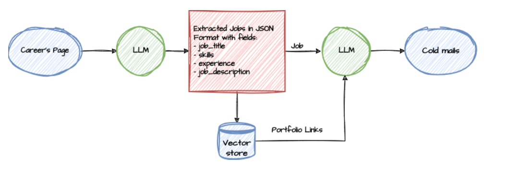

# Cold Email Generator

The **Cold Email Generator** is an AI-powered Streamlit app that automates outreach for developers, agencies, and freelancers. By providing a job posting URL, it extracts key requirements, matches them with relevant projects from the user’s portfolio using a vector database, and generates a personalized cold email using LLMs via LangChain and Groq Cloud.




## Use Cases

1. **B2B Lead Generation for Software Agencies**
   Software development agencies can monitor companies posting job openings for roles like "React Developer" or "Python Engineer". Instead of waiting, the agency can use this tool to instantly generate a hyper-personalized email offering their agency's services or staff augmentation, complete with relevant portfolio examples.

2. **Job Seekers / Freelancers**
   Individual developers applying for jobs can use this tool to quickly draft customized cover letters or cold emails to hiring managers. The generated email will automatically highlight the applicant's past projects that specifically align with the tech stack mentioned in the job description.

3. **IT Consulting Outreach**
   Consultants can feed the application job descriptions from target companies to understand their current technical needs and automatically generate a pitch explaining how their consulting services have solved similar problems in the past (using matched portfolio case studies).

## Architecture


## Architecture & Technologies
- **Frontend & UI:** Streamlit
- **LLM Integration:** Langchain, Groq Cloud (Llama 3.3, Mixtral)
- **Vector Database:** ChromaDB (for storing and querying portfolio items)
- **Data Scraping:** WebBaseLoader (Langchain Community)

 ## Usage

- **Input Job Posting:** Paste the URL of a job posting or enter job requirements manually
- **Analyze Requirements:** The AI will extract key skills, technologies, and requirements
- **Generate Email:** The system creates a personalized cold email based on your portfolio
- **Review & Customize:** Edit the generated email as needed before sending
- **Copy & Send:** Copy the final email to your email client

## Environmental Variables
Create a **.env** file in the app directory with the following variables:
```
GROQ_API_KEY=<YOUR_API_KEY>
```

## Installation
Follow these steps to set up and run the project:

1. **Clone this repo**
    ```
    https://github.com/Balaji-R-05/cold-email-generator.git
    cd cold-email-generator
    cd app          # Program stored in this folder
    ```
2. **Create a virtual environment (recommended)**
    ```
    python -m venv venv
    venv\Scripts\activate     # On Windows
    source venv/bin/activate     # On macOS/Linux
    ```
3. **To get started, first install the dependencies using:**
    ```
    pip install -r requirements.txt
    ```
4. **Run streamlit**
    ```
    streamlit run main.py
    ```
5. **Open your browser and navigate to http://localhost:8501**

## Deployment (Docker)

### Building and running your application locally

When you're ready, start your application by running:
```bash
docker compose up --build
```
Your application will be available at http://localhost:8501.

### Deploying your application to the cloud

First, build your Docker image:
```bash
docker build -t cold-email-generator .
```

If your cloud uses a different CPU architecture than your development machine (e.g., you are on a Mac M1 and your cloud provider is amd64), you'll want to build the image for that platform:
```bash
docker build --platform=linux/amd64 -t cold-email-generator .
```

Then, push it to your registry:
```bash
docker push myregistry.com/cold-email-generator
```

### References
* [Docker's Python guide](https://docs.docker.com/language/python/)