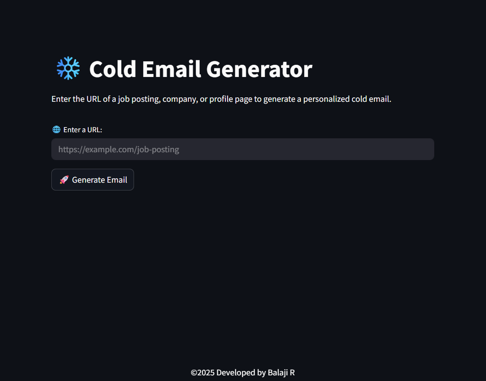
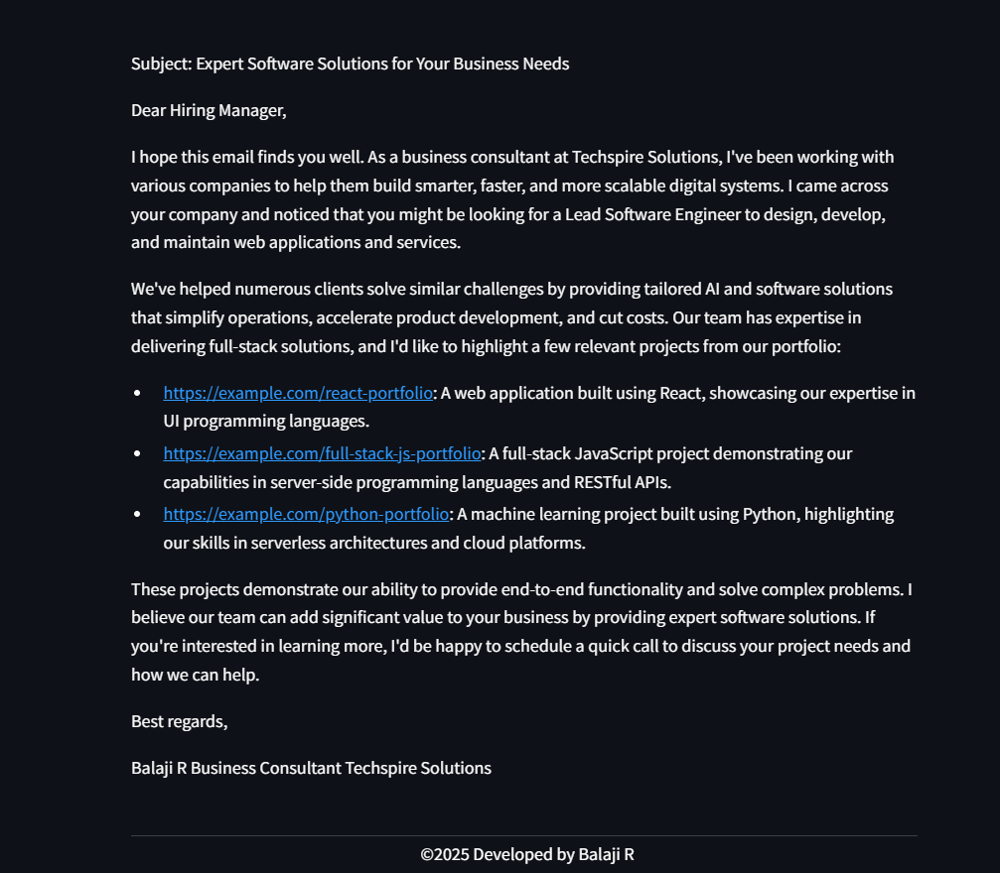

# Cold Email Generator

## Problem Statement
Helps companies to contact clients in need of software developers to build softwares and provide human resources.

<!-- <div style="display:flex">


</div> -->


## Architecture


## Tech Stack
- **Llama 3.3**
- **Chromadb**
- **Langchain**
- **Streamlit**
- **Groq Cloud**

 ## Usage

- **Input Job Posting:** Paste the URL of a job posting or enter job requirements manually
- **Analyze Requirements:** The AI will extract key skills, technologies, and requirements
- **Generate Email:** The system creates a personalized cold email based on your portfolio
- **Review & Customize:** Edit the generated email as needed before sending
- **Copy & Send:** Copy the final email to your email client

## Environmental Variables
Create a **.env** file in the app directory with the following variables:
```
GROQ_API_KEY=<YOUR_API_KEY>
```

## Installation
Follow these steps to set up and run the project:

1. **Clone this repo**
    ```
    https://github.com/Balaji-R-05/cold-email-generator.git
    cd cold-email-generator
    cd app          # Program stored in this folder
    ```
2. **Create a virtual environment (recommended)**
    ```
    python -m venv venv
    venv\Scripts\activate     # On Windows
    source venv/bin/activate     # On macOS/Linux
    ```
3. **To get started, first install the dependencies using:**
    ```
    pip install -r requirements.txt
    ```
4. **Run streamlit**
    ```
    streamlit run main.py
    ```
5. **Open your browser and navigate to http://localhost:8501**